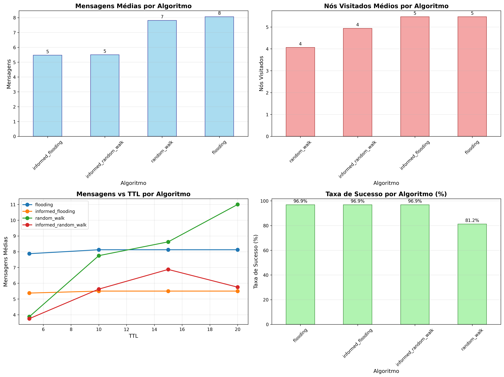
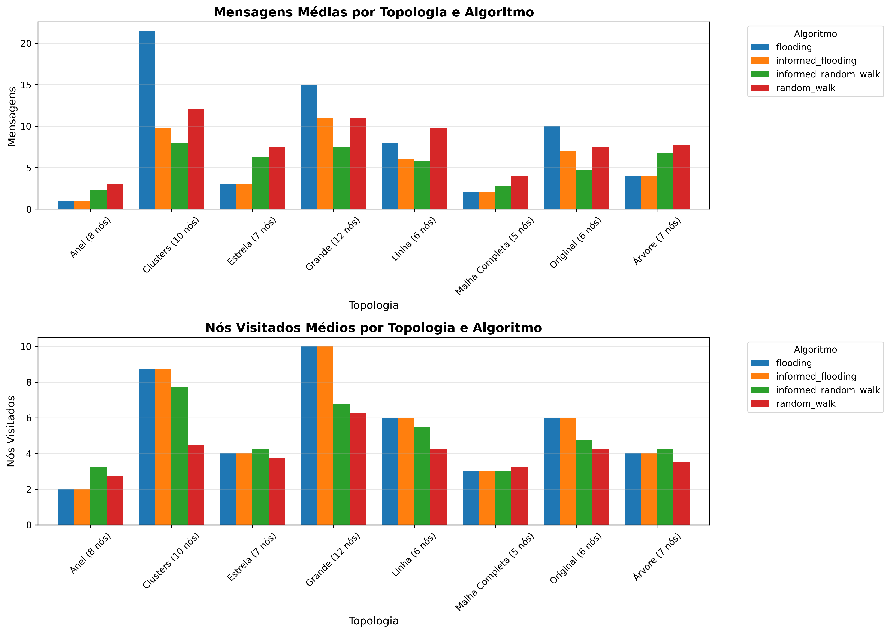

# Simulador de Rede P2P Não Estruturada

**Equipe:**
- Caio Cesar da Silva Martins

Este projeto implementa um simulador de rede P2P não estruturada com quatro algoritmos de busca:

- **Flooding** (BFS)
- **Informed Flooding** (BFS com cache)
- **Random Walk** (caminhada aleatória)
- **Informed Random Walk** (random walk com cache)

O simulador valida topologias de rede, executa buscas por recursos e compara o desempenho dos algoritmos em diferentes configurações.

## 🏗️ Estrutura do Projeto

```
├── main.py                    # Entry point principal
├── network.py                 # Estrutura da rede P2P
├── algorithms/                 # Implementação dos 4 algoritmos
├── visuals/                    # Visualizações (gráficos, GUI)
├── utils/                      # Validação, cache, métricas
├── tests/                      # Topologias de teste
└── run_comparative_tests.py   # Script de testes comparativos
```

## 📋 Requisitos

```bash
pip install -r requirements.txt
```

## 🚀 Como Usar

### Interface Gráfica (Recomendado)

```bash
python main.py tests/sample_config.json --gui
```

**Passos:**
1. Selecione o algoritmo no dropdown
2. Escolha nó inicial, recurso e TTL
3. Clique em "Executar Busca" ou "Executar Todos os Algoritmos"
4. Veja resultados e visualização da rede em tempo real

### Modo CLI

```bash
# Interativo
python main.py tests/sample_config.json

# Com parâmetros
python main.py tests/sample_config.json --algorithm flooding --start-node n1 --resource r6 --ttl 10
```

## 📊 Formato do Arquivo JSON

```json
{
  "num_nodes": 6,
  "min_neighbors": 2,
  "max_neighbors": 3,
  "resources": {
    "n1": ["r1"],
    "n2": ["r2"],
    "n3": ["r3"]
  },
  "edges": [
    ["n1", "n2"],
    ["n2", "n3"]
  ]
}
```

## ✅ Validações Implementadas

O simulador valida automaticamente:
- ✅ Rede conectada (sem partições)
- ✅ Graus dos nós dentro dos limites (min_neighbors ≤ grau ≤ max_neighbors)
- ✅ Todos os nós possuem recursos
- ✅ Nenhuma aresta self-loop

## 🧪 Testes Comparativos

Para executar testes em múltiplas topologias:

```bash
python run_comparative_tests.py
```

Este script testa 8 topologias diferentes (estrela, anel, malha, árvore, etc.) e gera:
- `comparative_analysis.png` - Gráficos comparativos gerais
- `topology_comparison.png` - Comparação por topologia
- `test_results.csv` - Dados completos dos testes

## 📈 Gráficos Gerados

### Análise Comparativa



**Explicação:**
- **Mensagens Médias**: Flooding envia mais mensagens; Random Walk é mais econômico.
- **Nós Visitados**: Flooding visita mais nós sistematicamente.
- **Mensagens vs TTL**: Comportamento dos algoritmos conforme aumenta o TTL.
- **Taxa de Sucesso**: Algoritmos informados têm melhor taxa devido ao cache.

### Comparação por Topologia



**Explicação:**
- Topologias mais conectadas (malha) geram mais mensagens no Flooding.
- Topologias lineares favorecem Random Walk.
- Algoritmos informados são mais eficientes em todas as topologias.

## 📊 Resultados Comparativos

**Flooding vs Informed Flooding:**
Informed Flooding economiza mensagens usando cache, mantendo alta taxa de sucesso.

**Random Walk vs Informed Random Walk:**
Informed Random Walk é mais eficiente e confiável, evitando nós que já sabemos que não têm o recurso.

**Conclusão:**
Algoritmos informados (com cache) são mais eficientes. Flooding garante encontrar o recurso mas com maior custo. Random Walk é mais rápido mas pode falhar com TTL baixo.

## 📤 Exemplo de Saída

```
================================================================================
RESULTADOS DA BUSCA
================================================================================
Algoritmo                Encontrado    Mensagens    Nós Visitados
--------------------------------------------------------------------------------
flooding                 Sim           9            6
informed_flooding        Sim           7            6
random_walk              Sim           10           5
informed_random_walk     Sim           3            4
================================================================================
```
